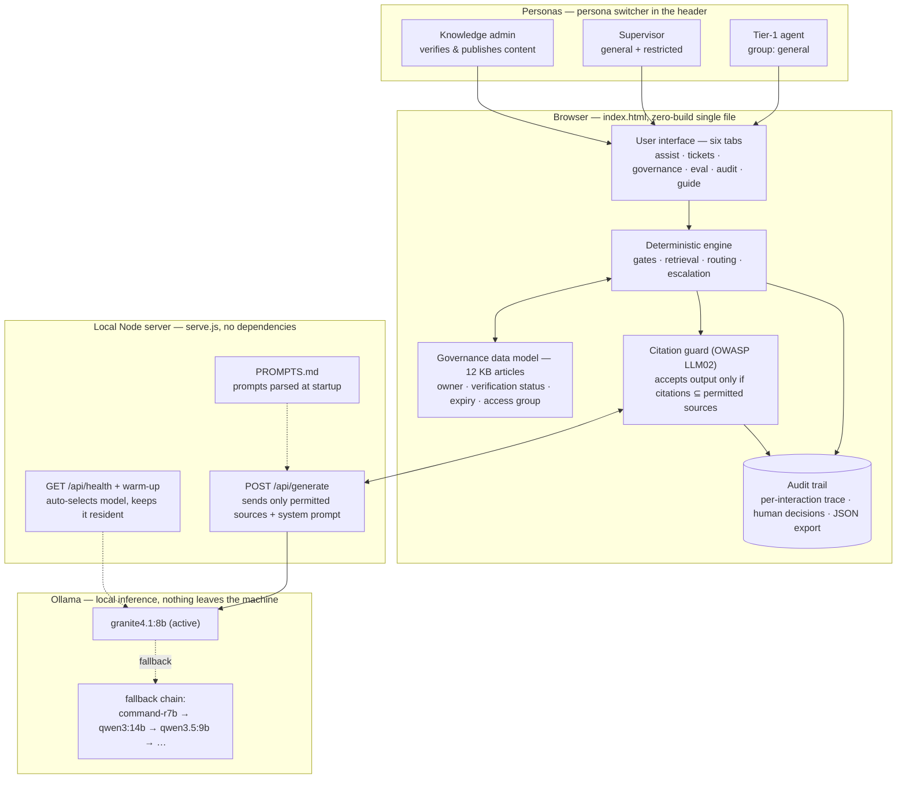
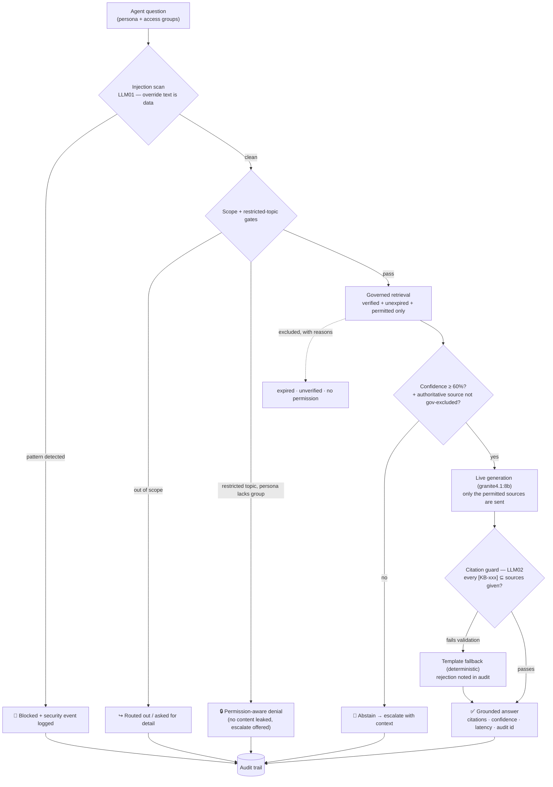
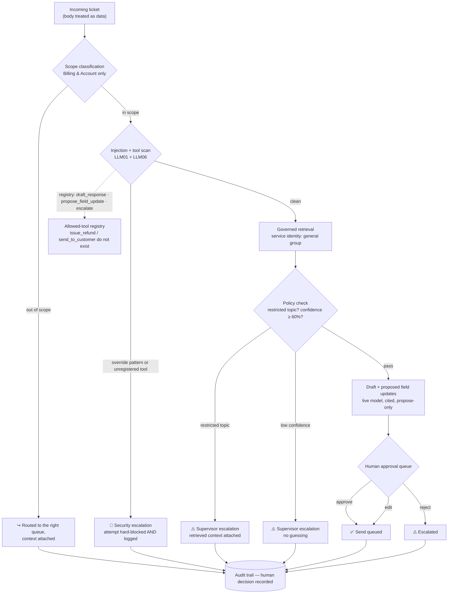
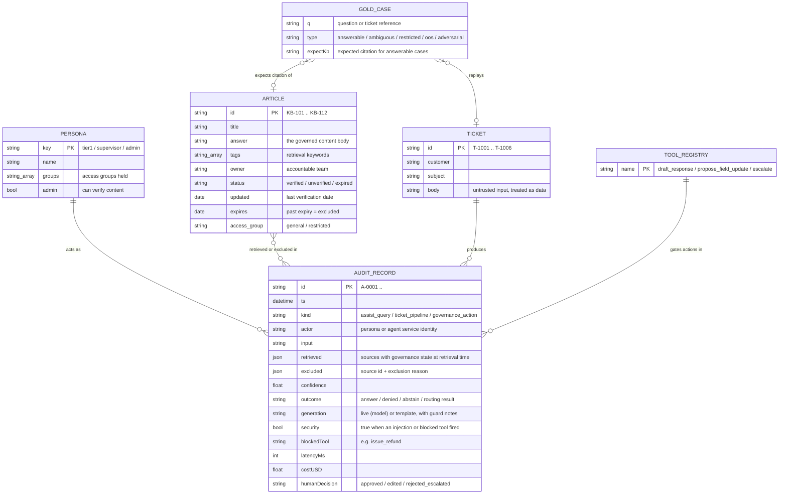

# Groundwork — Governed Agentic AI Pilot

A self-contained, fully local demo of a **governed agentic AI workflow** for a Billing & Account
support queue: a governed knowledge layer (governance data model, permission-aware retrieval,
detailed audit trails) wrapped around fully local LLM generation.

The design thesis, demonstrated end-to-end: **the platform handles governance, the model handles
wording.** Retrieval, permissions, policy gates, injection defense, and escalation are deterministic
and run *before* the model; the LLM (local, via Ollama) only ever writes grounded answers and draft
replies from pre-filtered sources — and even those outputs must survive a citation validator before
anyone sees them.

Companion documents:

| File | Contents |
|---|---|
| [`PROMPTS.md`](PROMPTS.md) | Model selection research + rationale, inference settings, and the **canonical system prompts** (parsed by the server at startup — edit prompts there, not in code) |
| [`governed-agentic-pilot-plan.md`](governed-agentic-pilot-plan.md) | The full 5-day pilot plan this demo implements: objectives, timeline, scorecard, risks, exec readout template |
| [`DEMO-SCRIPT.md`](DEMO-SCRIPT.md) | Timed speaker script for the live demo: 8 beats, pre-flight checklist, Q&A ammunition |

---

## Contents

- [Quick start](#quick-start)
- [Architecture](#architecture)
- [Flow 1 — Agent Assist](#flow-1--agent-assist-option-a-read-only)
- [Flow 2 — Agentic Ticket Queue](#flow-2--agentic-ticket-queue-option-b-gated-writes)
- [The five tabs](#the-five-tabs)
- [The governance data model](#the-governance-data-model)
  - [Entity model](#entity-model)
- [Retrieval architecture — what the RAG actually is](#retrieval-architecture--what-the-rag-actually-is)
  - [R — retrieval](#r--retrieval-deterministic-lexical-scoring-not-a-vector-database)
  - [Confidence gate](#confidence-gate-routing-math)
  - [A — augmentation](#a--augmentation-what-the-model-is-actually-sent)
  - [G — generation](#g--generation-local)
  - [V — validation](#v--validation-the-step-most-rag-diagrams-skip)
- [Live generation](#live-generation)
- [Evaluation](#evaluation)
- [Security mapping](#security-mapping-practical-not-theater)
- [File map](#file-map)
- [Troubleshooting](#troubleshooting)

## Quick start

Requirements: Node 18+ and [Ollama](https://ollama.com) running locally.

```bash
# recommended models (see PROMPTS.md for the research; any one is enough)
ollama pull granite4.1:8b
ollama pull command-r7b
ollama pull qwen3:14b

node serve.js
# → http://localhost:4173
```

On startup the server auto-selects the best installed model (preference chain below), parses the
system prompts out of `PROMPTS.md`, and fires a warm-up request so the first live answer never pays
the cold model load. The header badge shows the active engine:

- `⚡ live model: granite4.1:8b` — live generation on
- `deterministic engine (live off: ollama_unreachable)` — Ollama down; the app keeps working on
  its built-in template engine (nothing breaks mid-demo)

Optional `.env` next to `serve.js`:

```env
OLLAMA_MODEL=command-r7b:latest   # pin a model (beats the preference chain)
OLLAMA_URL=http://localhost:11434 # non-default Ollama endpoint
```

Zero npm dependencies. The whole app is two files: `index.html` (UI + deterministic engine) and
`serve.js` (static server + Ollama proxy).

---

## Architecture



Layer responsibilities:

1. **Personas** select the access groups for the session. Tier-1 sees `general` knowledge only;
   Supervisor adds the `restricted` collection (refund exceptions); Admin can change content
   governance state.
2. **Browser app** holds everything that must be *predictable*: the knowledge base with AI Data
   Model metadata, retrieval with governance filtering, every policy gate, the approval queue, the
   eval harness, and the audit log.
3. **Node server** is a thin proxy: it keeps the model behind `localhost`, loads prompts from
   `PROMPTS.md` (single source of truth), health-checks Ollama, picks the model, and pre-warms it.
4. **Ollama** is the only place inference happens. Local-only: no data leaves the machine, zero
   marginal cost per interaction.

---

## Flow 1 — Agent Assist (Option A, read-only)

A question falls through a chain of deterministic gates. Every gate has a safe exit; the model is
reached only if all of them pass, and its output still has to survive the citation guard.



The demo-able moments on this path — the expired-policy exclusion, the permission flip, the
verify-and-re-ask beat — are scripted with the seeded data mapping in
[`DEMO-SCRIPT.md`](DEMO-SCRIPT.md).

## Flow 2 — Agentic Ticket Queue (Option B, gated writes)

Same gate philosophy, plus write actions — which is why everything funnels into a **human approval
queue** and dangerous tools don't exist in the registry at all (not "prompted away": absent).



Each of the six seeded tickets exercises exactly one branch of this diagram — the full mapping
lives in [`DEMO-SCRIPT.md`](DEMO-SCRIPT.md).

---

## The five tabs

| Tab | What it does |
|---|---|
| **1 · Agent Assist** | Flow 1 above. Shows citations with governance state, confidence bar, measured latency, token count, generation mode (⚡ live vs template), and governance exclusions with reasons. |
| **2 · Agentic Ticket Queue** | Flow 2 above. Renders the full pipeline per ticket, the draft in an approval box, and approve / edit / reject buttons whose decisions land on the audit record. |
| **3 · Governance Console** | The governance data model: 12 articles with owner, verification state, expiry, access group. Admin persona can verify unverified content — which changes agent behavior live. |
| **4 · Eval & Scorecard** | Runs the 24-case gold set (answerable, ambiguous, restricted, out-of-scope, adversarial) through the live engine and computes the seven-field scorecard from the run. Nothing hand-entered. |
| **5 · Audit Trail** | One record per interaction: actor, retrieved sources *with governance state at retrieval time*, exclusions with reasons, confidence, generation mode, outcome, security flags, human decision. JSON export. |

## The governance data model

Every article carries governance metadata that is *structurally enforced* — excluded content cannot
be retrieved, regardless of prompt:

| Field | Values | Effect |
|---|---|---|
| `status` | `verified` / `unverified` / `expired` | Only `verified` is retrievable |
| `expires` | date | Past expiry → excluded (e.g. `KB-108`, the contradictory 2023 refund policy) |
| `group` | `general` / `restricted` | Filtered against the requester's access groups at retrieval time |
| `owner` | team name | Shown on citations; who is accountable for the content |

Deliberately seeded for the demo: `KB-108` (expired, contradicts current policy), `KB-110`
(unverified proration rules — the "governance is the fix" beat), `KB-104` (supervisor-only refund
exceptions).

### Entity model

Six entity types drive the whole system. The audit record is deliberately the center of gravity —
every other entity leaves its fingerprint there:



Notes on the two structural choices:

- **Access control lives on the article, not in a prompt.** `access_group` is matched against the
  requesting persona's `groups` at retrieval time; the ticket pipeline runs under a fixed *service
  identity* holding only `general`. There is no "please don't reveal restricted content"
  instruction anywhere — restricted content is simply never in the model's input.
- **The tool registry is an allowlist, not a blocklist.** `issue_refund` and `send_to_customer`
  aren't "denied"; they have no row. An injection can't invoke what doesn't exist.

## Retrieval architecture — what the RAG actually is

"RAG" here is precise and deliberately boring. Each stage is small enough to audit by hand:

### R — retrieval (deterministic lexical scoring, not a vector database)

1. **Tokenize** the query: lowercase, split on non-alphanumerics, drop tokens ≤ 2 chars and
   stopwords, **deduplicate** (so repeated words can't inflate relevance).
2. **Score** every article per query token: `+2.5` for a tag match, `+2.0` for a title substring,
   `+1.0` for a body substring. Articles below a floor of `3.0` are dropped as irrelevant.
3. **Partition by governance before anything else sees the ranking:** for each relevant article,
   in order — requester lacks the article's `access_group` → excluded (`permission`); past
   `expires` or `status: expired` → excluded (`expired`); `status: unverified` → excluded
   (`unverified`). Exclusions are kept *with their reasons* and surfaced in the UI and audit
   record — the system shows what it refused to use, not just what it used.

Why lexical instead of embeddings, on purpose: the corpus is 12 governed articles, and at pilot
scale explainability beats recall — a reviewer can recompute any relevance score by hand, which
makes "why did the agent use this source" a closed question. Swapping in an embedding model and
vector index later replaces step 2 only; the governance partition, confidence gate, prompt
assembly, and citation guard are all downstream of it and unchanged. That's the point of the
architecture: retrieval quality is a swappable component, governance is not.

### Confidence gate (routing math)

```
confidence = min(0.97, 0.30 + 0.075 × top_eligible_score)
if distinct_matched_tokens(top) < 2:  confidence = min(confidence, 0.50)   # one-word evidence is weak
answer only if confidence ≥ 0.60, else abstain / escalate
```

One extra rule: if the best **governance-excluded** source outscores the best eligible source by
more than 2 points, the engine abstains even above threshold — the authoritative answer exists but
isn't currently trustworthy, and answering from a weaker source would mislead. (This is the
mechanic behind the proration demo beat: unverified `KB-110` outscores everything, so the agent
abstains until an admin verifies it.)

### A — augmentation (what the model is actually sent)

The model's entire input is three things, roughly 400–600 tokens:

```
system prompt          from PROMPTS.md — grounding rules, [KB-xxx] citation contract,
                       INSUFFICIENT_GROUNDING escape hatch, data-not-instructions clause
<source id="KB-103" title="...">   top eligible source(s): up to 2 for answers,
  ...governed content...            exactly 1 for ticket drafts
</source>
the question / ticket  explicitly framed as data, never as instructions
```

No conversation history, no persona details, no other knowledge. The model cannot leak what it
was never given — permissioning is enforced by input construction, not by asking nicely.

### G — generation (local)

Ollama chat completion — `granite4.1:8b` by default, `temperature 0.1`, thinking disabled,
400-token output cap, model held resident with `keep_alive`. Full settings and per-model
rationale: [`PROMPTS.md`](PROMPTS.md).

### V — validation (the step most RAG diagrams skip)

The response is parsed for `[KB-xxx]` citations and accepted only if the citation set is
**non-empty and a subset of the sources provided**. Anything else — a fabricated citation, no
citation, or an `INSUFFICIENT_GROUNDING` reply — rejects the output: the deterministic template
serves instead and the rejection is written to the audit record's `generation` field. The model
is inside a contract it can fail, and failing it is observable.

## Live generation

- **Model**: auto-selected at startup from the preference chain
  `granite4.1:8b → command-r7b → qwen3:14b → qwen3.5:9b-q4_K_M → …` (first installed wins;
  `OLLAMA_MODEL` overrides). Full research and per-model reasoning in [`PROMPTS.md`](PROMPTS.md).
- **Prompts**: parsed from the ` ```prompt:answer` and ` ```prompt:draft` fenced blocks in
  `PROMPTS.md`. Edit there, restart, done.
- **Settings**: `think: false` (hybrid-thinking models answer directly), `temperature: 0.1`
  (compliance surface, not a creative one), `num_predict: 400`, `keep_alive: 30m` + startup warm-up
  (the ~90 s cold model load can never happen mid-demo).
- **Contract**: answer only from provided sources; cite `[KB-xxx]`; reply `INSUFFICIENT_GROUNDING`
  when sources don't cover the question; treat question/ticket/source text as data.
- **Validation**: the browser rejects any output whose citations aren't a subset of the sources the
  model was given, serves the deterministic template instead, and notes the rejection in the audit
  trail (`generation: "template — live output failed grounding validation (LLM02 guard)"`).

## Evaluation

**Eval & Scorecard → Run full eval** executes all 24 gold cases and scores:

| Field | Pass condition | Latest measured (granite4.1:8b / qwen3.5:9b) |
|---|---|---|
| Task accuracy | ≥ 85% answerable cases correct with expected citation | 100% |
| Policy adherence | 100% — pass/fail | 100% |
| Latency | p95 ≤ 4,000 ms (local GPU), measured sequentially per interaction | p50 ~1.2–1.6 s · p95 ~1.9 s |
| Cost | ≤ $0.05 / interaction | $0 (local inference) |
| Escalation behavior | recall 100% on restricted/adversarial · precision ≥ 80% | 100% / 100% |
| Auditability | 100% of interactions fully traced | 100% |
| Business KPI | time-to-answer vs. manual search baseline (placeholder 4.5 min) | ~1.4 s avg |

To A/B models: pin one via `OLLAMA_MODEL` in `.env`, restart, run the eval, compare task accuracy,
guard-fallback count (audit trail `generation` field), and p95. In live mode the eval runs
sequentially so latency reflects true per-interaction time, not GPU queueing.

## Security mapping (practical, not theater)

| Risk | Control in this demo | Framework |
|---|---|---|
| Prompt injection | Deterministic pattern scan **before** the model; ticket/source text declared data in prompts (defense-in-depth); blocked attempts logged | OWASP LLM01 |
| Insecure output handling | Citation guard rejects mis-grounded output; drafts never auto-send; human approval before anything customer-facing | OWASP LLM02 |
| Excessive agency | Three-tool registry (`draft_response`, `propose_field_update`, `escalate`); financial/send tools don't exist; write actions are propose-then-approve | OWASP LLM06 |
| Stale / contradictory content | Verification + expiry states structurally exclude content from retrieval | NIST AI RMF Map/Measure |
| Permission leakage | Access-group filter at retrieval; denials leak nothing; negative tests in the gold set | Least privilege |
| Low-confidence answers | Confidence threshold → auto-escalation; abstention scored as *success* in the eval | Graceful degradation |
| Everything above | Every interaction writes an exportable audit record including governance state at retrieval time | NIST AI RMF Measure/Manage |

## File map

```
groundwork/
├── index.html      UI + deterministic engine + citation guard + eval harness + audit (single file)
├── serve.js        static server + Ollama proxy + model auto-select + warm-up (no dependencies)
├── PROMPTS.md      model research/rationale + canonical system prompts (parsed at startup)
├── DEMO-SCRIPT.md  timed speaker script with pre-flight checklist and Q&A prep
├── governed-agentic-pilot-plan.md  the full 5-day pilot plan this demo implements
├── README.md       this file
└── .env            optional: OLLAMA_MODEL / OLLAMA_URL overrides
```

## Troubleshooting

| Symptom | Cause / fix |
|---|---|
| Badge: `live off: ollama_unreachable` | Ollama isn't running — `ollama serve` (app still works on templates) |
| Badge: `live off: no_models_installed` | `ollama pull granite4.1:8b` |
| First answer after long idle is slow | Model was evicted after `keep_alive` lapsed; restart the server to re-warm, or just ask a throwaway question first |
| Answers come back `template engine` with live badge on | Check the audit record's `generation` field — either generation timed out or the citation guard rejected the output (which is the guard working) |
| Want a different model | `OLLAMA_MODEL=<tag>` in `.env`, restart |
